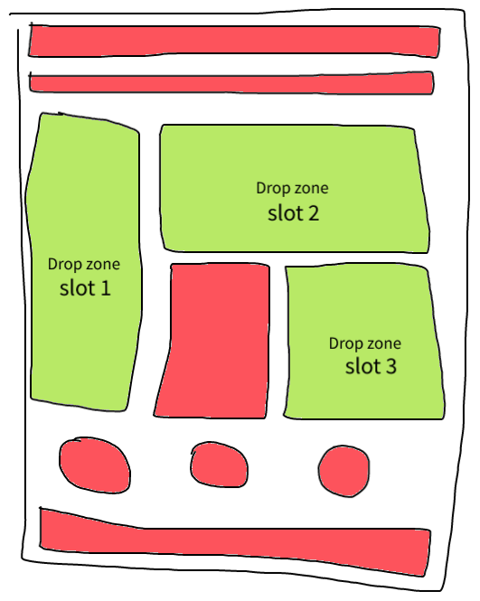

# POC on Multi-Slot Adobe Experience Manager (AEM) Templates

## About

The Adobe Experience Manager (AEM) has a tool called SPA Editor. It is a WYSIWYG tool that allows users to create pages visually, by draggin and dropping compontents on a page. That page can then, later, load data dynamically from AEM CMS in order to populate the components added.

The default drop zone is composed of one large area. All components can be dropped there. However, in real world scenarios, it is often desirable to create a scheleton (template) in which the structure is more complex. Many pages are composed of Headers, Menus, Footers, and other elements that remain the same... leading to the creation of multiple isolated dropping zones around them.

This repo contains a simple POC that I made in partnership with Adobe (AEM) Support team. Using the template and code solutions proposed here, I was able to confirm the POC that it is possible to create a Multi-Slot Template for AEM SPA Editor, which maintain a more elaborate structure with repeated elements that cannot be changed by the SPA Editor user.

That solution is specially valuable for situations in which we want to prepare AEM to be used by Business personnel, with not much technical expertise, and, therefore, could accidentally damage the websites structure if it wasn't protected. That is why creating a template with fixed elements and multi-slots as dropping zones is so valuable.

---

## Technologies used

- `AEM - Adobe Experience Manage`
- `Angular`

---

## POC result

Confirmed.
